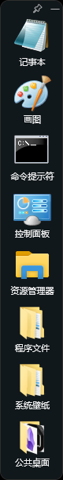
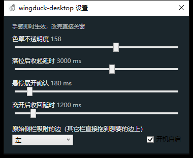

# wingduck-desktop

Windows 桌面贴边快捷方式侧栏。把你常用的快捷方式和文件夹收进一根半透明圆角窄栏，靠边自动收成 8px 细条，鼠标碰上去滑出，点一下就启动。

**它只存路径引用，不搬你的文件。** 从侧栏移除条目，桌面上的原文件一个字节都不会动。

## 长这样

展开态 · 收起后只剩 8px 细条 · 设置面板

  

## 安装

到 [Releases](releases) 下载 `wingduck-desktop-setup.exe`，双击安装即可——程序自带 .NET 运行时，**目标机器不需要另外装 .NET**。

- 需要 **Windows 10 版本 1607 或更高**（Windows 11 也可以）。Windows 7 / 8.1 及以下装不上，安装包会直接告诉你原因，而不是双击没反应。
- 只出 x64。安装到当前用户目录，**不需要管理员权限**（以管理员运行反而会废掉从桌面拖入条目这个功能——系统的 UIPI 会静默拦掉跨完整性级别的拖放消息）。
- 卸载走标准"应用和功能"，会删净程序文件但**保留你的清单和设置**，重装不用重新挑一遍。

## 它会做什么

- 从桌面或资源管理器把 `.lnk` / `.exe` / 文件夹拖进侧栏，也可以右键手动选路径
- 拖到屏幕任一条边（上下左右）自动贴边，随后收成细条；鼠标碰上去滑出，离开一会儿收回
- 点条目即启动程序 / 打开快捷方式目标 / 打开文件夹（文件夹一律开资源管理器，不做二级展开）
- 条目可拖动排序；右键菜单：打开 / 打开所在位置 / 重命名显示名 / 从侧栏移除
- 拖窗口边框改大小，或让它按图标数自适应；顶部"钉住"按钮让它停在原位不收起
- 一条侧栏不够用：右键任意位置或托盘菜单"新增卡片栏"，多条侧栏各自独立收条目、独立记位置与尺寸
- 托盘图标可显示 / 设置 / 退出，右键菜单里能直接开关开机自启
- 设置面板改色罩浓度、收起延时、展开延时，改完立即生效

## 数据放在哪

全部在你自己的机器上，两个 JSON 文件：

```
%APPDATA%\wingduck-desktop\
├─ items.json        每条侧栏一份（原始那条用这个名，新增的第 N 条用 items-<N>.json）
├─ settings.json     色罩浓度、延时、自启、每条侧栏的边与尺寸
└─ log.txt           只记异常与启动/退出，不记条目路径
```

条目里只有 `name` / `path` / `kind` / `order` 四个字段，**不存任何凭据**。清单文件被外部改坏时程序会把它备份成 `items.json.bad-<时间戳>` 并起一个空侧栏，不会崩。

**零网络请求、零遥测。** 这个程序不需要联网也能装、能用、能更新清单。

## 从源码构建

需要 .NET 8 SDK（含 Windows Desktop 组件）。

```bash
dotnet build src/WingDuck.Desk -c Release      # 调试构建
dotnet publish src/WingDuck.Desk -c Release -r win-x64 --self-contained -p:PublishSingleFile=true
```

打安装包另需 Inno Setup 6：

```bash
ISCC.exe installer/wingduck-desktop.iss
```

主程序**零第三方 NuGet 依赖**（托盘用的是 WindowsDesktop 共享框架里已有的 WinForms）。

## 明确不做

接管或隐藏桌面图标、文件夹二级展开面板、多主题多套配置、快捷键唤起、跨机器同步、插件系统、Microsoft Store 分发、非 Windows 平台。

## 已知边界

- 全部实测都在 **Windows 10 22H2（19045）** 一台机器上完成的。**Windows 11 按接口口径能跑**（用到的接口全都有，外观是自绘的、不依赖系统毛玻璃），但**没有在 Win11 真机上验证过**；Win11 的通知区域行为和 Win10 不完全一样，属于"能不能找得到托盘图标"的手感问题，不是崩溃风险。
- 多显示器副屏的吸附**未实测**。
- .NET 8 的官方支持到 2026-11-10。到期后这个 exe **照跑不误**（运行时已经打进去了），只是不再有安全补丁。

## 许可

MIT，见 [LICENSE](LICENSE)。
